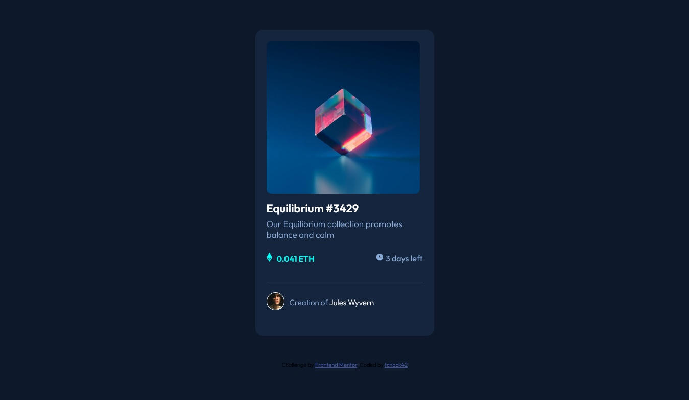

# Frontend Mentor - NFT preview card component solution

This is my solution to the [NFT preview card component challenge on Frontend Mentor](https://www.frontendmentor.io/challenges/nft-preview-card-component-SbdUL_w0U). Frontend Mentor challenges help you improve our coding skills by building realistic projects. 

## Table of contents

- [Overview](#overview)
  - [The challenge](#the-challenge)
  - [Screenshot](#screenshot)
  - [Links](#links)
- [My process](#my-process)
  - [Built with](#built-with)
  - [What I learned](#what-i-learned)
  - [Continued development](#continued-development)
  - [Useful resources](#useful-resources)
- [Author](#author)


## Overview

### The challenge

Users should be able to:

- View the optimal layout depending on their device's screen size
- See hover states for interactive elements

### Screenshot



Here is the screshot of the solution I made for this challenge

### Links

- Solution URL: [Github](https://github.com/tchock42/NFT-Preview-Card-Component-Main)
- Live Site URL: [Netlify](https://calm-concha-cd9367.netlify.app/)

## My process

### Built with

- Semantic HTML5 markup
- CSS custom properties
- Flexbox
- Mobile-first workflow


### What I learned

Making this project I remembered the elements link Position, Absolute and Relative. Those elements were important to complete the active states of the image.


```CSS
.overlay{
    position: absolute;
    top: 0;
    bottom: 0;
    left: 0;
    right: 0;
    height: 100%;
    max-width: 100%;
    opacity: 0; /*no-visible*/
    transition: .3s ease;
    background-color: var(--cyanTransparent);
    border-radius: 1rem;
    display: flex;
    align-items: center;
    justify-content: center;
}
.container:hover .overlay{
    opacity: 1;
    cursor: pointer;
}
```

### Continued development

I was wondering if other elements could change the cyan-state of the overlay image. I mean, if the cursor is over a text, it activate the cyan-state.

### Useful resources

- [W3schools](https://www.w3schools.com/howto/howto_css_image_overlay_icon.asp) - This site help to understand how to use the overlay and I adapted the example there to my project.


## Author

- Github - [tchock42](https://github.com/tchock42)
- Frontend Mentor - [@tchock42](https://www.frontendmentor.io/profile/tchock42)


